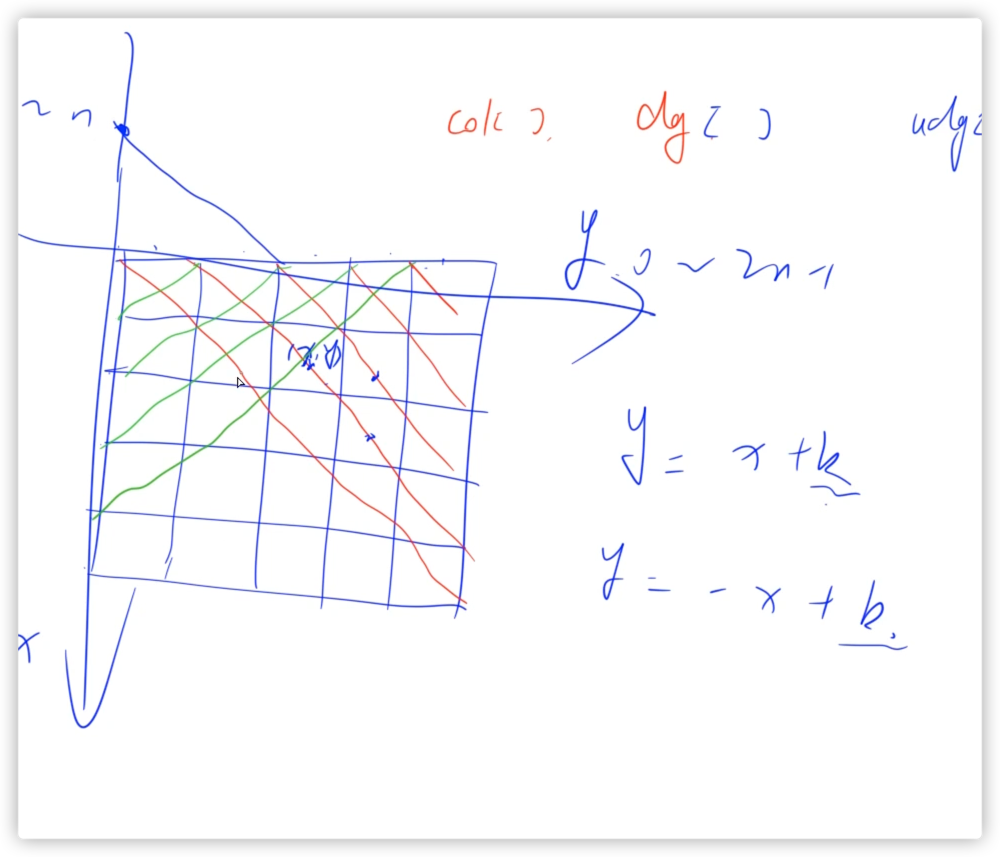

# 算法笔记

## 1. 链表

> 链表用数组来表示，

- 单链表 数组模拟单链表，如何模拟。e代表的是这个数的值，ne代表的是这个数的下一个数的位置 重点理解：

  3 -> 5 -> 4 -> 2 -> 1 e[0] = 3, e[1] = 5, e[2] = 4 ne[0] = 1, ne[1] = 2, ne[3] = 4
  idx只是记录下使用的节点，相当于临时拿过来用的一个数。因为链表不是连续的，只需要指向对就可以了.
- 双联表

## LeetCode_1_两数之和

需要注意先判定当前num和在哈希表中存不存在targit - num，不存在再put进去，不要自己加自己的情况

```java
class Main {
    public static int[] twoSum(int[] nums, int target) {
        HashMap<Integer, Integer> map = new HashMap<>();
        for (int i = 0; i < nums.length; i++) {
            if (map.containsKey(target - nums[i])) return new int[]{i, map.get(target - nums[i])};
            map.put(nums[i], i);
        }
        return new int[]{};
    }
}    
```

---

## LeetCode_2_两数相加

> 主要思路就是用一个变量t记录相加的合， t % 10记录当前节点存的数值， t / 10保存进位的数值

```java
public class LeetCode_2_两数相加 {
    public ListNode addTwoNumbers(ListNode l1, ListNode l2) {

        ListNode dummary = new ListNode(-1);
        ListNode cur = dummary;
        int t = 0;
        while (l1 != null || l2 != null) {
            if (l1 != null) {
                t += l1.val;
                l1 = l1.next;
            }
            if (l2 != null) {
                t += l2.val;
                l2 = l2.next;
            }

            cur.next = new ListNode(t % 10);
            cur = cur.next;
            t = t / 10;
        }
        if (t != 0) {
            cur.next = new ListNode(t);
        }
        return dummary.next;
    }

}
```

---

## LeetCode_3_求最长子串

通过哈希表存储字符串，key存储字符串，value存储出现的次数

双指针遍历字符串

```java
import java.util.HashMap;

class Main {
    static int get_res(String s) {

        char[] str = s.toCharArray();
        HashMap<Character, Integer> map = new HashMap<>();

        int res = 0;
        for (int i = 0, j = 0; j < str.length; j++) {

            map.put(str[j], map.getOrDefault(map.get(str[j]), 0) + 1);

            while (map.get(str[j]) > 1) {
                map.put(str[i], map.get(str[i]) - 1);
                i++;
            }

            res = Math.max(res, j - i + 1);
        }
        return res;
    }
}
```

---

## LeetCode_5_最长回文子串

```java
public class LeetCode_5_最长回文子串 {
    public static String longestPalindrome(String s) {
        char[] str = s.toCharArray();
        int n = str.length;

        String res = "";
        for (int i = 0; i < n; i++) {
            int l = i - 1, r = i + 1;
            while (l >= 0 && r < str.length && str[l] == str[r]) {
                l--;
                r++;
            }
            if (res.length() < r - l - 1) res = s.substring(l + 1, r);//注意函数左闭右开

            l = i;
            r = i + 1;
            while (l >= 0 && r < str.length && str[l] == str[r]) {
                l--;
                r++;
            }
            if (res.length() < r - l - 1) res = s.substring(l + 1, r);
        }

        return res;
    }


    public static void main(String[] args) {
        String s = "cbbd";
        longestPalindrome(s);
    }
}
```

---

[LeetCode_31_下一个排列](https://www.acwing.com/solution/content/110616/)

## n皇后问题

1. 对于斜线上的判重复，把每一条斜线分为一类，总共包括正方向的 n 条和反方向的 n 条
2. 具体表示哪一条斜线，需要通过坐标映射到数组中。通过在y轴上的k值来具体表示哪一条斜线，而k值为负的情况则需要通过偏移量处理
   